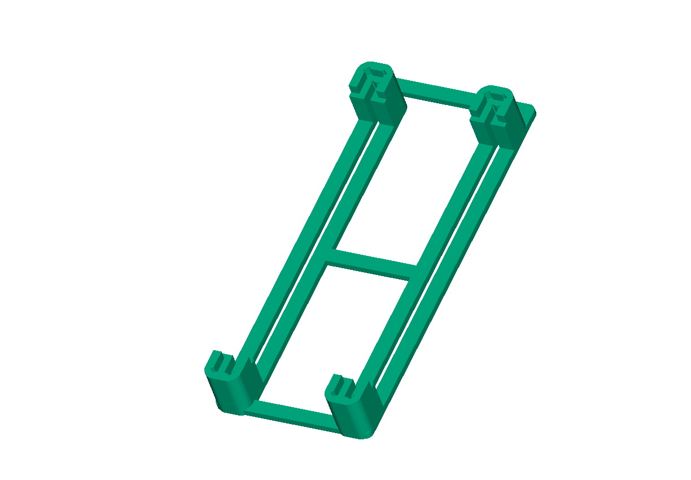
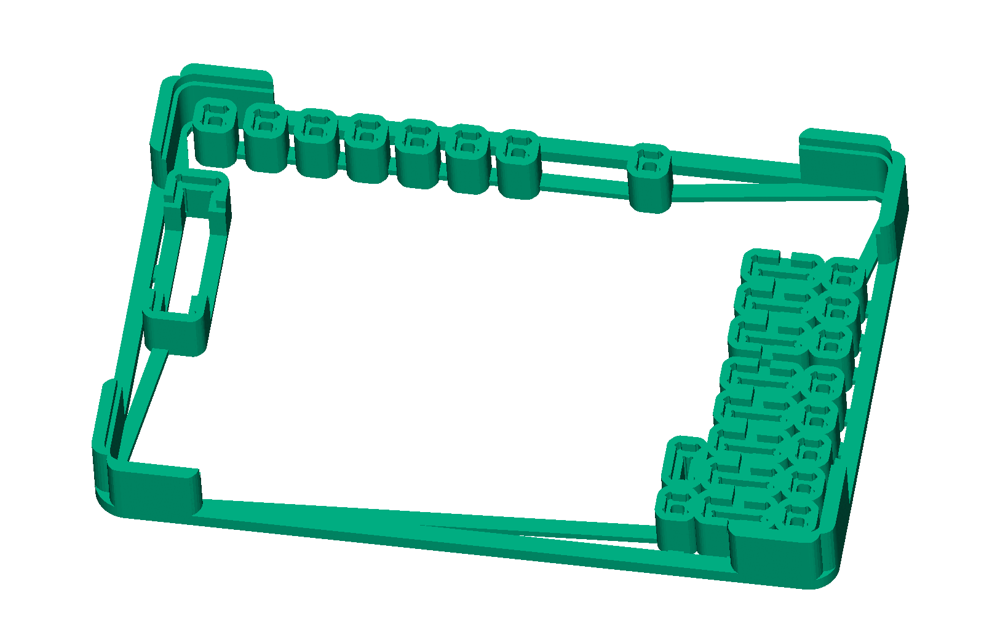
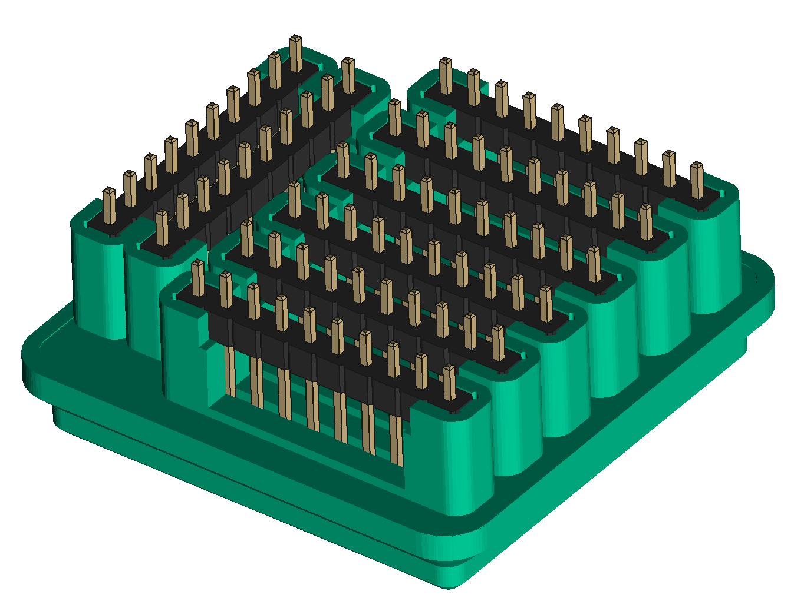

# Jig It !

Ease PCB assembly with 3D printed jigs. Achieve perfectly aligned connectors, with no special motor skills!

JigIt is licensed under the AGPL 3.0 License. If you work with electronics, it can
help you save time, material and money. Should you find value in this tool, the
author implores you to take on the moral obligation of abiding by the
"Equal Opportunity" manifesto. Details of what "equal opportunity" means and your
obligations are in [this page](EQUAL-OPPORTUNITY.md). Please take a moment to read
it before you start using the software.

Starting with a PCB design, JigIt achieves this workflow:

 1. Create a 3D printable jig design from a PCB design.
 2. Print jig.
 3. Mount components and PCB on jig. If you notice tolerance issues, tweak parameters, goto step 1.
 4. Solder away for perfect results... every time !

Do checkout [this project's hackaday page](https://hackaday.io/project/198409-pcb-assembly-jig-generator)
for stories and updates.

## Demos

There are many ways to use JigIt. Checkout the [demos directory](demos) for details; here are some examples:

[Raspberry Pi Pico/Pico 2](demo/01-rpi-pico-soldering-jig/README.md)

[Pico Glitcher Board](demo/02-pico-glitcher/README.md)

JigIt is generic. Have a crazy board like this ProtoConn to solder ?

See [ProtoCon demo](demo/06-lots-of-connectors/README.md) for the details; the jig would look and work like this:

[Gridfinity Containers for Electronics](demo/05-gridfinity/README.md)

It's not just for soldering - make Gridfinity containers for all your electronic components in a snap:

## Getting Started

See the [Getting Started page](doc/GETTING-STARTED.md).
