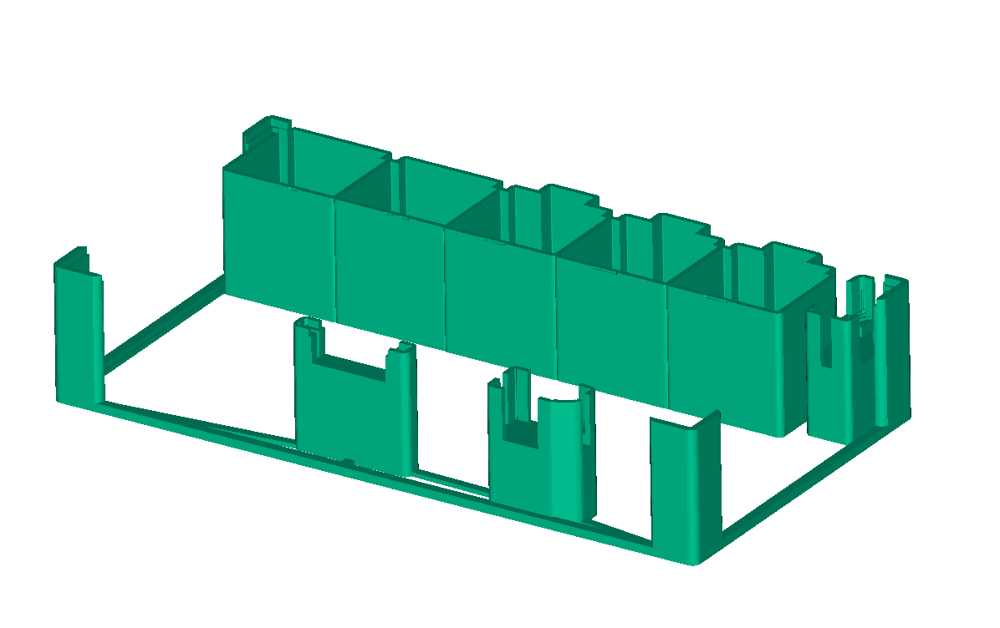
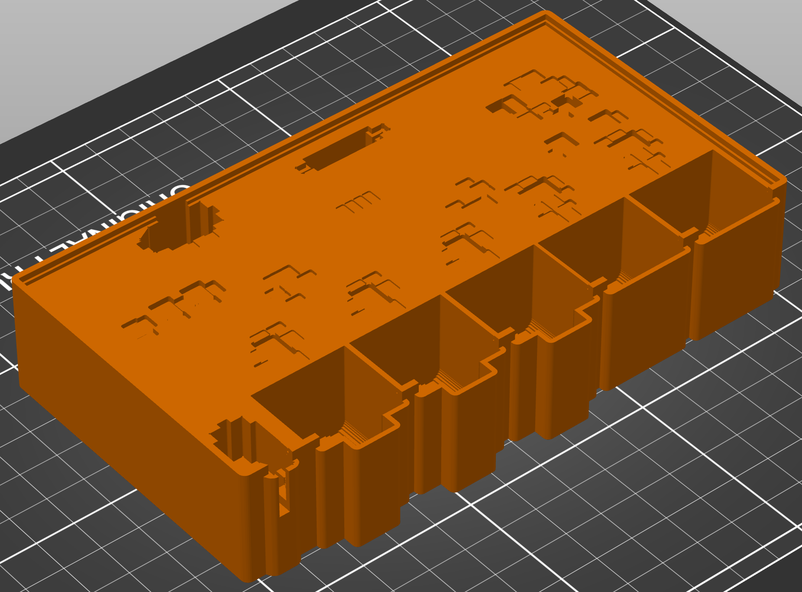

# FOSSDEM Audio Board

This illustrative example showcases jigit handling components of various heights.

[FOSSDEM](https://fosdem.org/2025/) conference uses a
[dedicated "videobox"](https://blog.brixit.nl/after-fosdem-videobox-updates/)
to record and live-stream their videos. Their "box" has various internal boards,
including a
[digital audio mixer board](https://blog.brixit.nl/digital-audio-mixer-pt-2/).

The audio board has a few XLR audio connectors (two different types of connectors),
a berg header, and a couple of audio jacks. The board looks roughly like this in
3D:

Jigit can be used to create a soldering jig for this board. We first need to get
the design files:

    git clone https://git.sr.ht/~martijnbraam/mixolydian-4x4

(tested with git commit a2705c04)

Next, use the following command:

    jigit \
      -i mixolydian-4x4/mixolydian-4x4.kicad_pcb \
      -c mixolydian-4x4.toml \
      -o jigs/mixolydian-4x4-soldering-jig.3mf

Here's how the generated jig [mixolydian-4x4-soldering-jig.3mf](jigs/mixolydian-4x4-soldering-jig.3mf)
looks and works:

The jig sits on a groove at the board edges. The PCB sits on it. Note that
different types of holding structures are generated for the two different types
of XLR connectors. Also note that the holding structures are connected to the
main structure, ensuring a printable single piece model.

The board also uses a Teensy 4.1. However, the 3D models for the teensy footprint
are not included in the PCB design. Thus, jigit doesn't generate structures to hold
the berg header used to mount the Teensy. Same is the case of the ethernet breakout
pins of the Teensy.

The jig generated jig here hasn't been tested with a real board. It should work,
though. You may also verify the fitting by opening this file in FreeCAD:
[fitting/mixolydian-4x4-jig-fitting.FCStd](fitting/mixolydian-4x4-jig-fitting.FCStd)

This is a medium size PCB - 152 mm x 80 mm. The jig would take an estimated 43 grams of
material, and print in 4 hrs 30 min at 0.2mm layer height in my printer (Prusa i3
MK2 with 0.4 mm nozzle).

A common way of creating soldering jigs involves manually creating cavities inside
a solid. With a change of options, Jigit can generate such jigs as well..! E.g.

    jigit \
      -i mixolydian-4x4/mixolydian-4x4.kicad_pcb \
      -c mixolydian-4x4-solid.toml \
      -o jigs/mixolydian-4x4-soldering-jig-solid.3mf

That gives us [mixolydian-4x4-soldering-jig-solid.3mf](jigs/mixolydian-4x4-soldering-jig-solid.3mf),
which looks like this:

This model has cavities for SMD components with ample clearance.  A partially
assembled board (e.g. with SMD components) can thus be used with this jig.

Printing this model even with 5% infill would need 80 grams of material (2x) and
6 hrs+ on my printer with 0.2mm layer height. We save close to 50% on time and
material by generating component holders where needed.

Finally, sparse holders makes it easy to examine and verify (and if necessary tune)
the fit.