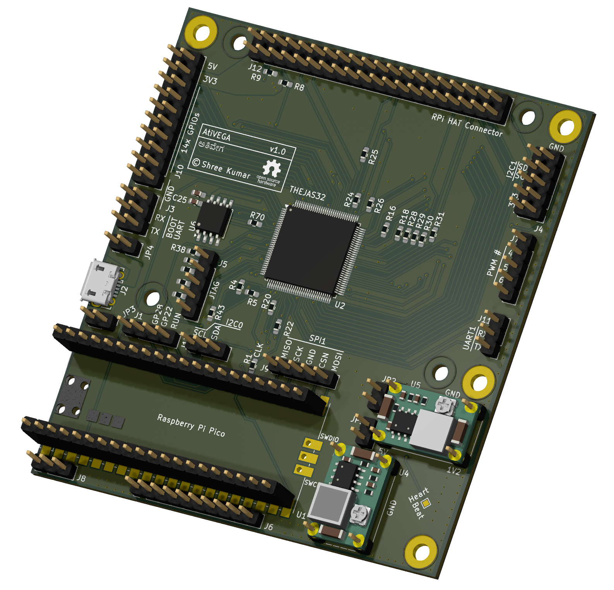
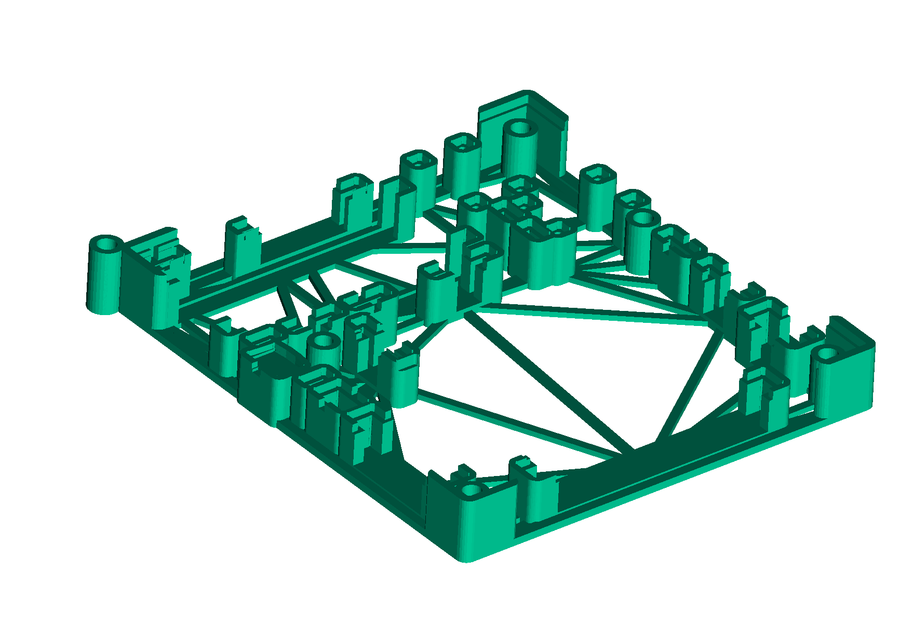
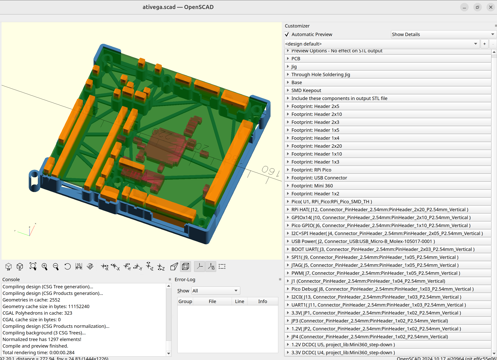
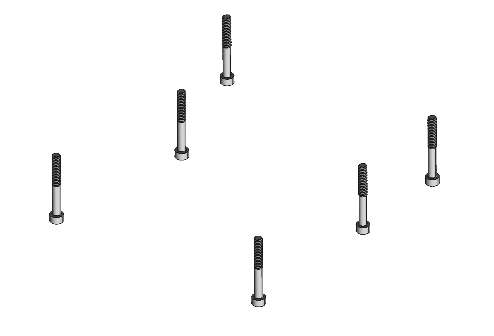
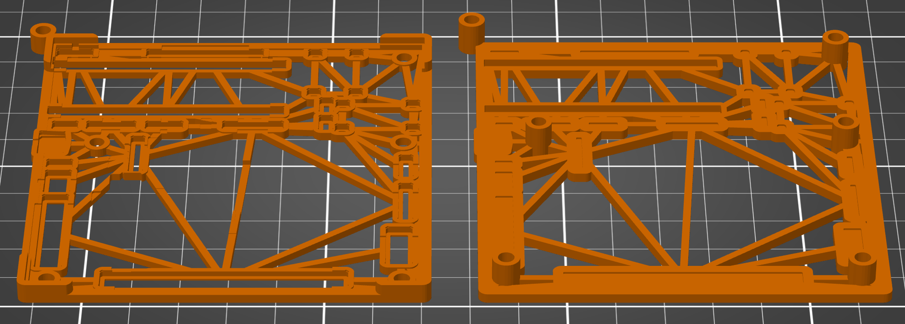

# AtiVEGA

[AtiVEGA](https://github.com/shreekumar3d/thejas32-testbed) is the board that
lead to the creation of this project.  AtiVEGA is a project to study, understand
and document the THEJAS32 microcontroller.

## Story

Many FOSS projects are born out of personal pain points. For Jigita, AtiVEGA
was that pain. Or rather, the pain of soldering the headers on the board.
The board has 26 separate headers:

  * 1 2x20 pin header
  * 1 2x10 pin header
  * 2 1x20 pin sockets
  * 1 1x10 pin header
  * 1 2x5 pin header
  * 1 2x3 pin header
  * 3 1x5 pin headers
  * 1 1x4 pin header
  * 3 1x3 pin headers
  * 4 1x2 pin headers
  * 8 single pin headers!

The single row headers were downright frustrating to solder. I was not happy
with the results as the headers were not perfectly straight most of the times.
Soldering the single pin headers was agony. Not that all that didn't work. It
did. It's just that the effort was too much, and that the results were ugly.

A better method was needed. That's when I decided to build a 3D printed
jig for this. The various shell algorithms evolved with me iteratively testing
jigs with the board. I was always trying to get the fitting right, never once
bothering to solder the board during development. I also realized that this
tool would be generically useful, so I built it as a command line tool with
input from a config file to tweak various things down to a component level.

## Make the Jig!

First, get the design files:

    git clone https://github.com/shreekumar3d/thejas32-testbed

The jig I use now for assembling the board is generated using jigit, using the
following command:

    jigit \
      -i thejas32-testbed/hw/thejas32-testbed.kicad_pcb \
      -c ativega.toml \
      -o jigs/ativega-jig.3mf

The resulting jig [jigs/ativega-jig.3mf](jigs/ativega-jig.3mf) has a shell (holder) for
every component. The PCB can sit in the groove at the four corners. It also has
a provision to insert M3 bolts at the locations of the mounting holes. Additionally,
an M3 bolt may be used near the corner of the PCB that lacks a mounting hole in
the board design.

The workflow with the jig is:

 1. Start with the jig
 2. Insert M3 bolts, lay flat on a table (optional)
 3. Insert headers and USB connector (optional)
 4. Insert the PCB, using the M3 bolts as guides
 5. Hold the PCB in place using M3 nuts (optional)
 6. Check fit and solder!

You may check the fitting of these, using FreeCAD by opening this file:
[fitting/ativega-jig-fitting.FCStd](fitting/ativega-jig-fitting.FCStd).

## OpenSCAD Customizer

Changing a configuration file and running the tool to tweak parameters is fine,
but a UI is nicer for tuning. OpenSCAD provides a simple customizer
UI. Jigit has interdependent configuration parameters; not all combinations are
valid. Such things can't be coded into the UI. This makes the customizer less
than ideal, but I figured out I would have to make things work with whatever
limitations it posed. The UI has some extra text which serves as warnings, but
that's pretty much it.

Generating the openscad file is a simple matter of changing the filename
extension of the output:

    jigit \
      -i thejas32-testbed/hw/thejas32-testbed.kicad_pcb \
      -c ativega.toml \
      -o jigs/ativega-jig.scad

Now you may open [jigs/ativega-jig.scad](jigs/ativega-jig.scad) using OpenSCAD. For
**_fast_** mesh generation performance, use a development version and turn on the
usage of Manifold (under Preferences > Advanced > 3D Rendering > Backend).

The panel on the right has helpful labels identifying components.

# Advanced Usage

## Two part jig

Jigit can create a "two part" jig as well. This makes even more of the internal
structure visible, and may take less time/material, depending on the mode
(not the case for AtiVEGA):

This is generated by using the following command with jigit:

    jigit \
      -i thejas32-testbed/hw/thejas32-testbed.kicad_pcb \
      -c ativega-2part-jig.toml \
      -o jigs/ativega-2part-jig.3mf

The resulting jig [jigs/ativega-2part-jig.3mf](jigs/ativega-2part-jig.3mf) has two
parts separated by a small gap.  This gap isn't visible easily.  However, you can
use an option in your slicer to split this into two parts. In Prusa Slicer, this
option is called "split to objects". After that, choose "arrange objects".
Once done, the model will look as below, in the slicer:

The model can now be printed.

The 2 part jig may feel somewhat flimsy compared to a single part jig.  This may
come in useful for projects that have taller jigs. It also sparks ideas about
other ways of building jigs - e.g. using laser cut thin acrylic or steel sheets,
or even cardboard.

The 2 part jig should be considered experimental. Tou should ideally cross-check
the generated jig in the slicer prior to printing.