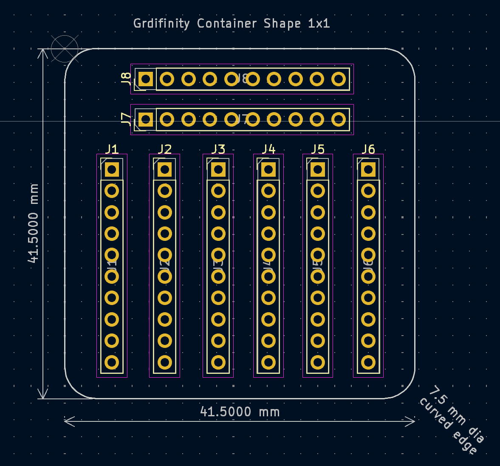
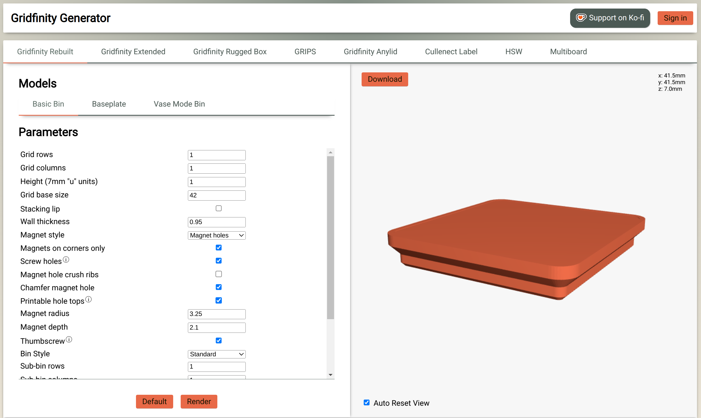
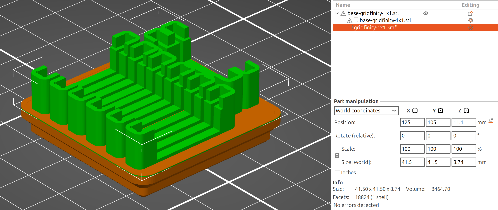
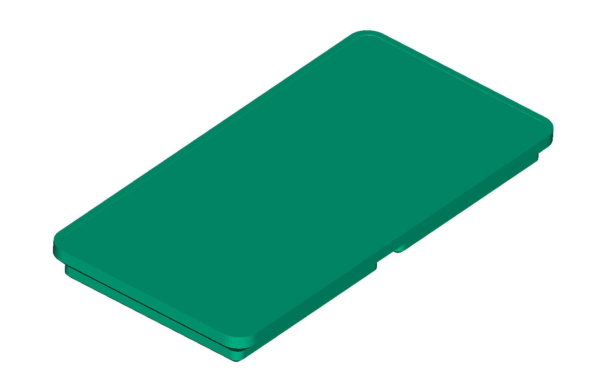

# Gridfinity Containers

Jigit can be used to build electronics storage containers for
[Gridfinity](https://gridfinity.xyz/), the popular open source grid storage system.
The cool thing about is that almost the entire workflow happens in your favourite
electronic design software, [KiCAD](https://www.kicad.org/).  KiCAD comes with a
huge library of parts. For components you use, you probably already have your
footprints and symbols defined. With Jigit you can build storage containers for
any of them, in any combination and more.

As an example, here is a gridfinity container that can hold eight 10 pin headers:

Gridfinity works on a grid of 42 mm x 42 mm for the baseplate. A single gridfinity
container is a rounded 41.5 mm square. See the
[specification](https://gridfinity.xyz/specification/) for details.

Jigs generated by jigit may be thought of as a storage container for a set of
electronic components.  The gridfinity container shape can be modelled as a PCB
shape.  The components you need to "store" in the container are placed on the
PCB as desired. Here is one sample layout for a gridfinity container that can
hold ten 1x10 pin standard(2.54mm pitch) headers:

Generating the Jig is a simple matter as usual:

    jigit \
      -i gridfinity-1x1/gridfinity-1x1.kicad_pcb \
      -c gridfinity.toml \
      -o jigs/gridfinity-1x1.3mf

Do refer to the settings in the configuration file
[gridfinity.toml](gridfinity.toml).

The resultant jig lacks the gridfinity base.  This needs to be merged in
to create a complete gridfinity container.

[Gridfinity Generator](https://gridfinity.perplexinglabs.com/pr/gridfinity-rebuilt/0/0)
provides a convenient way to generate gridfinity compatible base designs.
Setting height to 1 mm, and disabling the "stackiing lip" provides a convenient
building block with an almost flat top.

I have download and saved this file as
[base/base-gridfinity-1x1.stl](base/base-gridfinity-1x1.stl).

To merge the models, let's fire up the slicer (Prusa Slicer in my case).
We'll follow a workflow following the steps in
[this article](https://help.prusa3d.com/article/how-to-lift-object-from-the-print-bed_245192).
First we'll load the base model.  Then we'll right click on the model,
choose "Add Part...", then "Load". Then we'll select the generated jig file.
The jig will get added at unexpected positions. You'll need to match the
position (X, Y) of the jig to the base model. Then change the Z value to
make the generated jig "sit" on the base container. With the right values,
you'll end up with this:

You can now print the resulting file, or save it, say as
[containers/gridfinity-container-8x10pin-header.stl](containers/gridfinity-container-8x10pin-header.stl).
There you have it - gridfinity containers for your own components are just
a few minutes away.

I use FreeCAD with the
[KiCAD StepUp mod](https://www.kicad.org/external-tools/stepup/) workbench for
drawing the PCB outlines to the correct dimension and shape. The container
shapes are in
[gridfinity-container-shapes.FCStd](gridfinity-container-shapes.FCStd)

# Beyond Electronic Components...

KiCAD allows you to load mutiple 3D models into a footprint. These models are
thus not restricted to being electronics components... they can be anything
else too!  After arranging these models in your desired arrangement, you can
then use Jigit to generate generic holders.

Using KiCAD this way is somewhat unusual... but possible! JigIt doesn't have
a UI (yet!) so KiCAD is basically a round-about way to place objects in 3D,
and then have JigIt do its work.

Here is an example of a gridfinity container holding three allen keys -
 M2, M3 and M4:

The relevant files are:

  * KiCAD Design file:
    [allen-keys/allen-keys.kicad_pcb](allen-keys/allen-keys.kicad_pcb)
  * Allen Key 3D models were generated using the Fasteners workbench in FreeCAD,
    and are in [allen-keys/3dmodels](allen-keys/3dmodels)
  * Configuration file to generate jig : [allen-keys.toml](allen-keys.toml)
  * Generated Jig : [jigs/allen-keys.3mf](jigs/allen-keys.3mf)
  * Merged Gridfinity container : [containers/gridfinity-container-allen-keys.stl](containers/gridfinity-container-allen-keys.stl)
  * Gridfinity container base: [base/base-gridfinity-2x1.stl](base/base-gridfinity-2x1.stl)

The workflow is same as earlier, except 3D models of allen keys are assigned
to KiCAD footprints. 3D models also positioned on the same side as the PCB.
If you lookup the design you'll find that they are positioned that the allen
keys are at the same level, despite their differing sizes. Jigit would
ordinarily ignore those; force_mount" is set to true in the config file to
include those.

The jig was generated (as you might expect) using this command:

    jigit \
      -i allen-keys/allen-keys.kicad_pcb \
      -c allen-keys.toml \
      -o jigs/allen-keys.3mf

This feature may be used in many ways. Shipping a kit of components and some
extra hardware ? Use it to add some polish to your kit!