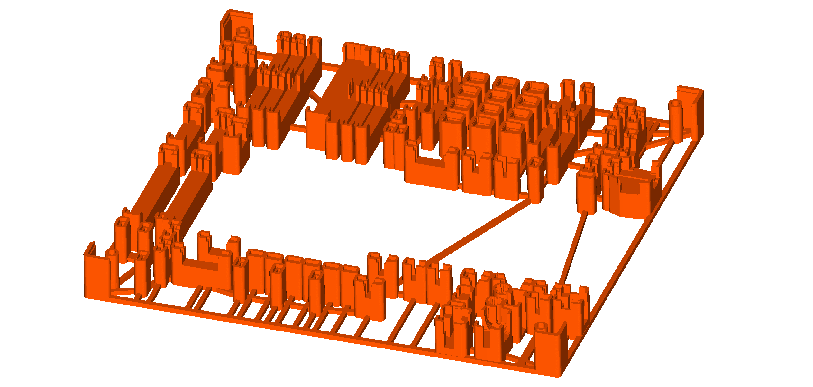

# ProtoConn

[ProtoConn](https://github.com/Pakequis/ProtoConn) is a prototyping board with
connectors for electronic testing and development. It has an seriously impressive
array of connectors:

Soldering all those components is quite a task.  The large board size of 200x195 mm
calls for some method to hold everything in place.

Here is a soldering jig that solves the problem, created with JigIt:

This isn't tested yet, but apart from a USB connector that can't be soldered (it's
probably set to SMD) there is a good chance it would work.

To generate the jig, first clone the ProtoConn repository:

    git clone https://github.com/Pakequis/ProtoConn

(tested against commit ffd7c437a8)

The jig was generated using:

    jigit \
      -i ProtoConn/Hardware/ProtoConn.kicad_pcb \
      -c ProtoConn.toml \
      -o jigs/ProtoConn-soldering-jig.3mf

The pre-generated jig is at [jigs/ProtoConn-soldering-jig.3mf](jigs/ProtoConn-soldering-jig.3mf).
You can also take a closer look at the fitting of the jig and the components
by using FreeCAD with this file:
[fitting/ProtoConn-soldering-jig-fitting.FCStd](fitting/ProtoConn-soldering-jig-fitting.FCStd)
