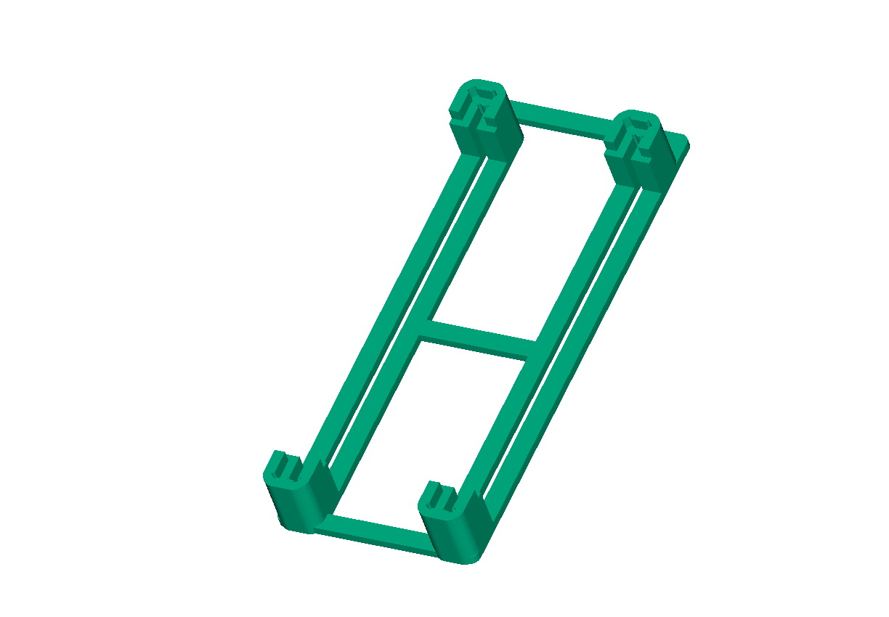
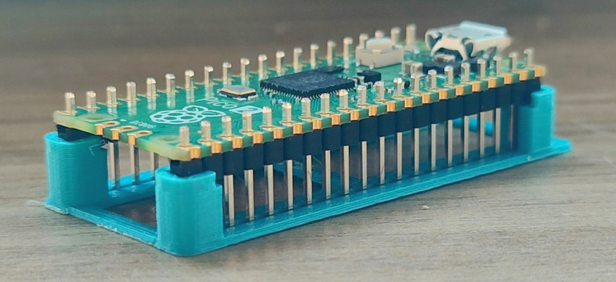
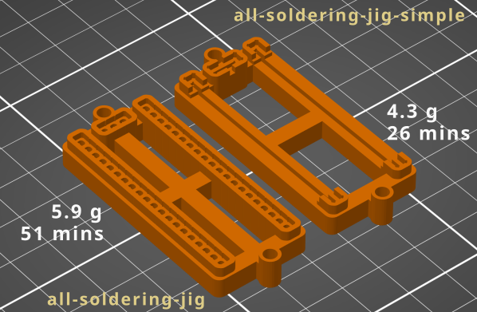

# Soldering Jig for RPi Pico/Pico 2

Raspberry Pi Pico is available in with and without header variants. The price
difference between these variants is significant, typically around 1 USD.
Another way to look at it, it's 25% more expensive to buy the boards with
headers soldered!

Low cost headers are generally at a fraction of that price. Typically you get
40 pin headers that need to be broken into two and soldered. To solder the
headers you need to keep them straight. A breadboard may be used for this.

Using jigit, you can generate a 3D model for a soldering jig that you can 3D
print and use in many ways.

test-boards/footprint-test/README.md has an example that you can use to solder
without creating a complete jig. However, generating a dedicated jig has some
advantages. This is suitable, especially if:

* You want to try out this system
* You need to solder a lot of boards, and you want to make it as good and as
  painless as possible!
* You are a perfectionist who wants to (with proof!) solder perfectly vertical
  headers :smiley:
* You are running a training or learning program where attendees have to solder
  and achieve good results without needing high skill.

To generate the soldering jig, we need a model of Raspberry Pi Pico. Raspberry
Pi does not provide KiCAD files for Pico variants. Luckily, there a couple of
clone boards that we can use.  While not 100% clones, they are roughly boards
of the same dimensions as the Pico. They use the same positioning of the berg
headers. For the purpose of generating jig for soldering headers, they are useful!

Pre-generated jigs are included for easy usage in the jigs sub-directory. The
rest of this document explains how they were created.

## Project piCo

[Project piCo](https://github.com/sabogalc/project-piCo) has a few Pico clone
designs that include a USB-C connector, rather than the micro-USB connector
on the official board. Let's start by downloading these:

    git clone https://github.com/sabogalc/project-piCo.git

(NOTE: This was tested with commit 69bf9b9 of project-piCo git tree)

The file project-piCo/KiCad Projects/Pico C/RPI-PICO-R3a-PUBLIC.kicad_pcb is
a good start for jig creation. J1 and J2 are the single row 20 pin headers on
the board.  These are marked as "Front" mounted, though they are actually
mounted on the back of the board. This necessiates some tweaks.

project-piCo.toml has the settings required.  Creating the jig is a simple matter
of executing the following command:

    jigit \
        --bottom-components \
        -i project-piCo/KiCad\ Projects/Pico\ C/RPI-PICO-R3a-PUBLIC.kicad_pcb \
        -c project-piCo.toml \
        -o jigs/pico-soldering-jig.3mf

And then printing it ! This is how you will use the 3D printed jig:

Don't be surprised that the main PCB above doesn't look like a Rasperry Pi
Pico ! piCo is a clone with USB-C connector, with a slightly longer
PCB. That doesn't impact the long headers that we are interested in.
With FreeCAD, you may also checkout the fitting in the file
[fitting/project-piCo-with-soldering-jig.FCStd](fitting/project-piCo-with-soldering-jig.FCStd).

The printed jig works very well with a real Pico(2). It clearly reveals the
perfect fitment of the connectors at a glance, as you can see below:

The jig is also efficient - consuming less than 2 grams of filament, and
printing in less than 15 minutes on my Prusa i3 MK2 at 0.2 mm layer height
with a 0.4mm nozzle. . For comparison, with the same settings on my printer
(these may change for you):

* [this jig on Printables](https://www.printables.com/model/739038-pico-soldering-jig) consumes
  8 grams of filament, with an estimated print time of about an hour
* Jig mentioned in this [Toms Hardware article](https://www.tomshardware.com/news/maker-creates-raspberry-pi-pico-3d-printed-soldering-jig)
  is less than 7 grams, with an estimated prints time of about half an hour

The settings in project-piCo.toml setup jigit to treat J1 and J2 as components
mounted on the bottom side (flip_side=false). You may tweak the other paramaters
to get various results:

* tweak line_width and line_height to make the jig chunkier
* increase thickness value in holder.base to create a frame that can
  be held in a PCB vice

## The Perfect Jig ?

What if you want to solder a 3 pin berg header as a debug connector ? Project
piCo does not include this.  Another clone, 
[Mitayi Pico](https://github.com/CIRCUITSTATE/Mitayi-Pico-RP2040) models it in
the right place.  However, it uses a right angled connector, which is frankly
not a problem, but that's not what I want to show here.

To help with this, I've created a simplified PCB design :
pico-th-jig/pico-th-jig.kicad_pcb . This models the external outline and
connectors on the board (including the debug header), but none of the actual
layout. For simplicity, headers are placed on the top side of the board.
To build a jig with this, use the corresponding config file pico-th-jig.toml,
as follows:

    jigit \
        -i pico-th-jig/pico-th-jig.kicad_pcb \
        -c pico-th-jig.toml \
        -o jigs/pico-all-soldering-jig.3mf

This jig lets you solder the 3 pin connector on either side of
the Pico. To mount the debug connector on the top side, solder it in first,
with the PCB facing down. Then reverse the PCB and solder the two 20
pin headers. The component shells are of the "tight" type (holes for every pin!),
which provides the best fit and the least chance of movement of component in
its place, at the cost of increased print time and material.

This jig prints in about 50 minutes, consuming about 6 grams of filament.

If you need a slightly simpler model that prints easier, faster and consumes
less material, then you can set the shell type to "fitting". This results
in a simpler model. Use this command:

    jigit \
        -i pico-th-jig/pico-th-jig.kicad_pcb \
        -c pico-th-jig-simple.toml \
        -o jigs/pico-all-soldering-jig-simple.3mf

This jig also has a provision to hold the PCB securely on the board using
a couple of M3 bolts and nuts. Perhaps this last part is a bit of
over-engineering, but this shows that if you need it, you can have it!
